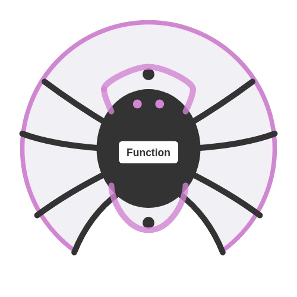
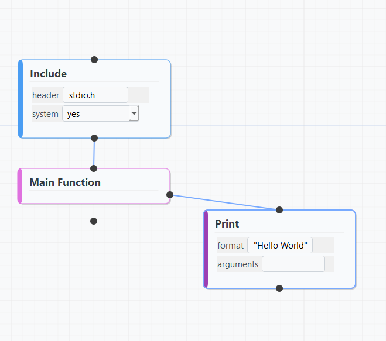
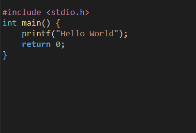
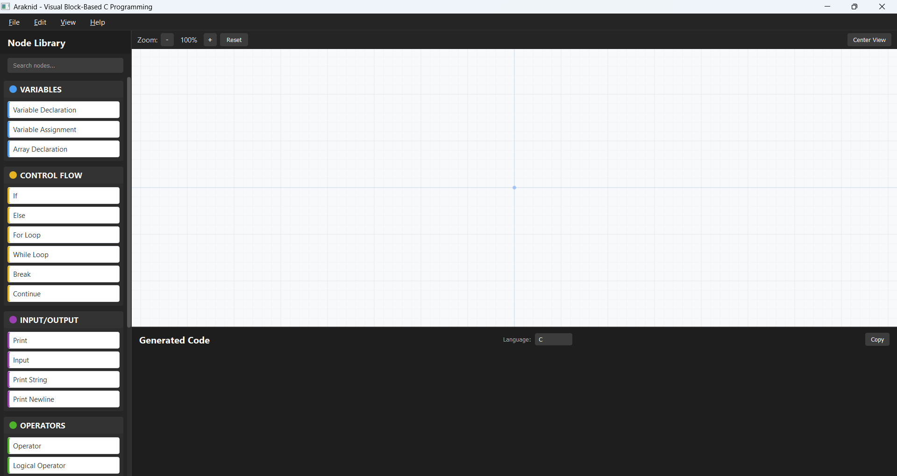
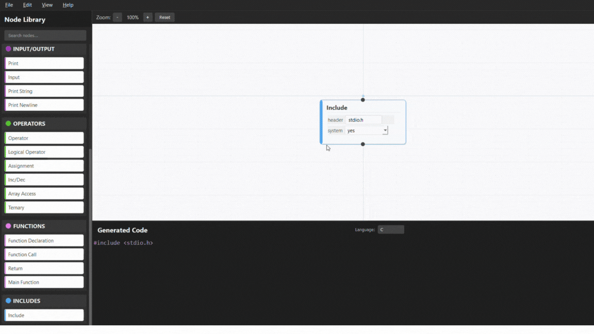

# Araknid - Visual Block-Based C Programming

<p align="center">
  
  <h3 align="center">Make C Programming Visual and Fun!</h3>
</p>

Araknid transforms traditional C programming into an engaging visual experience! With its intuitive drag-and-drop interface, you can build C programs using colorful, interconnected blocks – making programming concepts tangible and easy to understand.

## ✨ Features

- **🧩 Visual Block Programming** - Create C programs without typing a single line of code
- **🔄 Real-Time Code Generation** - See your visual blocks magically transform into C code
- **🎨 Modern Flyde-Inspired UI** - Enjoy a sleek, user-friendly interface
- **📚 Rich Block Library** - Access a comprehensive collection of pre-built blocks
- **💾 Project Management** - Save, load, and export your visual creations with ease
- **🚀 One-Click Execution** - Run your C programs directly from the interface

## 📸 Screenshots

### Visual Blocks for "Hello World"
Transform complex coding concepts into simple visual blocks - here's the classic "Hello World" program!
<div style="padding-top: 20px; padding-bottom: 20px;">
  
</div>

### Generated C Code
Watch as Araknid automatically generates clean, readable C code from your blocks.
<div style="padding-top: 20px; padding-bottom: 20px;">
  
</div>

### Full Application Window
Explore the elegant, intuitive interface designed to make programming accessible for everyone.
<div style="padding-top: 20px; padding-bottom: 20px;">
  
</div>

### Block Building in Action
See how easy it is to build programs by connecting blocks together!
<div style="padding-top: 20px; padding-bottom: 20px;">
  
</div>

## 🚀 Getting Started

### Installation
1. Clone this repository:
```
git clone https://github.com/afthabmhd/araknid.git
```

2. Install the required dependencies:
```
pip install PyQt5
```

3. Run the application:
```
python main.py
```

### Quick Start Guide
1. **Create New Project** - Click "File → New" or press `Ctrl+N`
2. **Add Blocks** - Drag blocks from the Node Library on the left panel
3. **Connect Blocks** - Link blocks by dragging from connection points
4. **Configure Properties** - Set values in block fields as needed
5. **View Generated Code** - See your C code appear in the bottom panel
6. **Save Your Work** - Use "File → Save" or `Ctrl+S`
7. **Export & Run** - Export as C code and run with a single click!

## 🎓 Perfect For

- **Students** learning programming fundamentals
- **Educators** teaching C concepts visually
- **Hobbyists** experimenting with algorithms
- **Visual thinkers** who prefer graphical interfaces
- **Anyone** intimidated by traditional text-based coding

## 💡 Tips & Tricks

- Use the search bar to quickly find specific blocks
- Right-click on the canvas for context menu options
- Middle-mouse button to pan around the canvas
- Ctrl+Wheel to zoom in and out
- Use "Center View" to reset your perspective
- Try starting with simple programs before advancing to complex ones!

## ⚖️ License

**All Rights Reserved**. This repository and its contents are protected by copyright law. You may **not** use, copy, modify, distribute, or create derivative works from this code without explicit permission from the author.

For permission requests, please contact: **Aftab Muhammad**.

## 📞 Contact & Support

Have questions or need assistance? Reach out to **Aftab Muhammad** via:

- Email: afthabmuhammadthayyil@gmail.com
- GitHub: [afthabmhd](https://github.com/afthabmhd)

---

<p align="center">
  <b>Araknid</b> - Where C Programming Meets Visual Creativity!
</p>

**Note**: This software is not open-source. All rights are reserved by the author.
